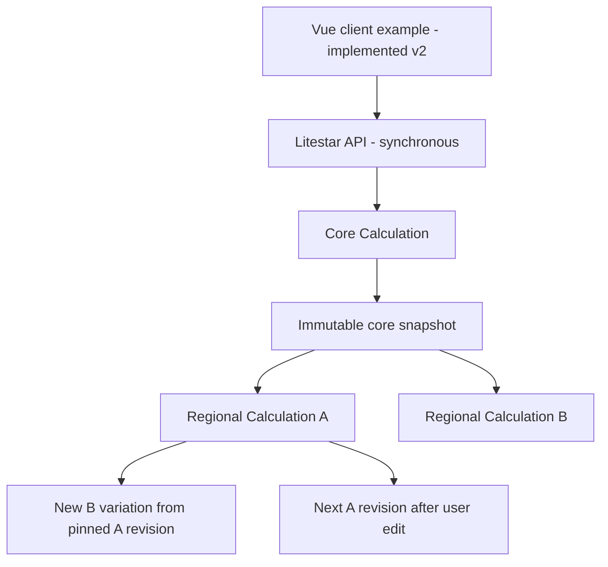

# Logical API and execution flow

This document shows the implemented **version 2** runtime: how one request
travels to the database and back, and a concrete policy example with the
exact SQL function releases and results. A separate target sequence below
shows the proposed asynchronous AWS flow. The full revision 3 target
(Data Contract storage, Bronze → Silver → Gold) and editable diagrams
are in [architecture/README.md](architecture/README.md). Lifecycle rules are
in [REQUIREMENTS.md](REQUIREMENTS.md); endpoints are listed in
[api/README.md](api/README.md).

The lifecycle is intentionally split: Core Calculation is frozen; Regional
Calculation is a separate mutable model with retained revisions.



## Request-to-database sequence

```mermaid
sequenceDiagram
    participant UI as Frontend client
    participant API as Litestar and ModelLifecycle
    participant W as Python worker
    participant SF as Gateway and Snowflake connector
    participant DB as Local emulator and DuckDB

    UI->>API: POST /core-models or /variations/{id}/calculate
    API->>SF: BEGIN and read pinned configuration
    SF->>DB: SQL via connector HTTP protocol
    DB-->>SF: Saved bindings and release metadata
    SF-->>API: Effective settings
    API->>W: Pass policies, bindings and dependencies
    W->>SF: Batched CALL_ID SQL function queries
    SF->>DB: Execute versioned SQL functions
    DB-->>SF: Correlated rows and query IDs
    SF-->>W: Parameter results
    W->>SF: SQL objective and calculation audit
    SF->>DB: SUM of objective UDF and INSERT trace
    DB-->>SF: Objective values and write acknowledgement
    SF-->>W: Objective results
    W-->>API: Results and iterations
    API->>SF: Save model, event, outbox and receipt; COMMIT
    SF->>DB: SQL writes in the same transaction
    DB-->>SF: Committed
    SF-->>API: Commit acknowledged
    API-->>UI: JSON snapshot and content hash
```

The worker is an in-process Python class inside the API. The optional audit
exporter later reads only undelivered outbox rows and writes an idempotent
DynamoDB projection; it never participates in the calculation transaction and
cannot change formulas or model snapshots (see
[README.md — Audit storage](README.md#audit-storage)).

## Revision 3 target: contract storage and asynchronous AWS runs

The main [Core phase, then custom runs sequence](architecture/09-parameter-layer-sequence.svg)
starts with Core transforming Bronze into Silver. After Core succeeds, the
user chooses a custom process, such as Regional Calculation, and overrides
parameters in its input. DataContract governs both phases. The supporting
[background execution sequence](architecture/11-assessment-client-updates.svg)
shows Python reading the published Data Contract before accepting the job,
freezing the input and rules, and returning a reference before the later
assessment outcome. The [retry sequence](architecture/12-calculation-retry-sequence.svg)
shows automatic recovery and the user's Retry calculation action. Both reuse
the original frozen input and plan; a later edit requires a new calculation.
[Who performs an assessment?](architecture/10-assessment-worker.svg) shows the
Python worker coordinating the job and Snowflake applying the policy formulas.
The browser makes short automatic status checks while work continues; a saved
failure is distinct from a temporary browser connection problem. See the
[business explanation](architecture/README.md#an-assessment-in-business-terms)
before the detailed system sequence below.

For a value-by-value example, [the coloured layer sequence](architecture/09-parameter-layer-sequence.svg)
follows `{ DeathPenatly: 1000 }` in Bronze to immutable Silver
`{ DeathPenatly: 800 }`. The user edits a separate regional scenario to
`{ DeathPenatly: 700 }`; a 10% reduction produces Gold
`{ DeathPenatly: 630 }`. A later edit to 600 produces a new result of 540.
Its simplified one-property rules are described in the
[architecture example](architecture/README.md#concrete-example).

This sequence is **design only**. Python publishes/reads immutable
`CONTRACT_REVISIONS` in Snowflake and interprets them; the database executes
released SQL functions. Draft editing/publication precedes run acceptance.
The proposed routes are in [api/openapi-v3-draft.yaml](api/openapi-v3-draft.yaml).

```mermaid
sequenceDiagram
    participant UI as Business user / Vue
    participant API as Calculation application / Litestar API
    participant Contract as DataContract / Snowflake rule catalogue
    participant DB as Models and run records / Snowflake
    participant Relay as Job dispatch service / Python outbox relay
    participant Q as Calculation queue / Amazon SQS FIFO
    participant W as Calculation worker / Python on ECS Fargate
    participant Events as Completion relay / EventBridge
    Note over UI,DB: Shared execution: Core produces Silver first; later custom runs use source + overrides
    UI->>API: POST /runs (phase core, or custom + processName; pinned input; contract)
    API->>DB: Check receipt and source/scenario revision
    API->>Contract: Read published DataContract for the selected phase/process
    Contract-->>API: Exact rules, allowed overrides and released functions
    Note over API,DB: Python validates and freezes input, process, contract version and execution plan
    API->>DB: COMMIT RUNS + receipt + RUN_OUTBOX atomically
    API-->>UI: 202 runId, pinned contract; Location: /runs/{runId}
    Relay->>DB: Read pending RUN_OUTBOX
    Relay->>Q: Send runId + generation (dedupId = dispatchId)
    Q-->>Relay: Accepted
    Relay->>DB: Mark this dispatch delivered
    W->>Q: Receive next queued dispatch
    Q-->>W: Saved run reference and dispatch generation
    W->>DB: Conditional claim; commit fenced lease + attempt start
    Note over W,DB: Load frozen plan; heartbeat lease and extend SQS visibility
    W->>DB: Execute synchronous batched SQL functions and objective
    alt Valid owner and calculation succeeds
        W->>DB: Atomic result + lineage + audit/outboxes + SUCCEEDED
        Note over W,DB: Fence commit; guard scenario revision and result pointer
        W->>Q: Delete message after commit
    else Calculation fails
        W->>DB: Roll back results; persist attempt error + RETRYABLE or FAILED
        Note over Q,W: Bounded redelivery; expired-lease reaper and DLQ reconciliation
    end
    UI->>API: GET /runs/{runId} with If-None-Match
    API->>DB: Read persisted run status
    API-->>UI: 200 status / immutable result reference, or 304
    Events->>DB: Read committed RUN_EVENT_OUTBOX
    Note over Events,DB: Publish RunCompleted; acknowledge only successful entries
    Note over API,DB: Existing AUDIT_OUTBOX to DynamoDB exporter stays independent
```

Queue ordering does not replace fenced run ownership or conditional scenario
pointer updates. Relay retries retain the dispatch ID; explicit retries use a
new dispatch generation but the same run and frozen plan. The detailed
[storage, failure and delivery rules](architecture/README.md#aws-run-orchestration-target-page-8)
include duplicate sends beyond FIFO deduplication, stale workers and DLQ
recovery. Step Functions Standard or Temporal is a later option for shared
workflow state across human waits and regional fan-out.

## Example policy transformation

Input policy `P-1001`:

| Parameter | Input |
|---|---:|
| Death | 250000.00 |
| AccidentalDeath | 300000.00 |
| TotalPermanentDisability | 200000.00 |
| CriticalIllness | 150000.00 |

Core Calculation configuration (`CORE_INSURANCE`, revision 1) resolves each
parameter to an exact SQL function release:

| Parameter | Database function and mapping | Core result |
|---|---|---:|
| Death | `CORE_LIMIT_AMOUNT_R1(Death, cap=300000)` | 250000.00 |
| AccidentalDeath | `CORE_LIMIT_RELATIVE_R1(AccidentalDeath, Death, ratio=1.00)` | 250000.00 |
| TotalPermanentDisability | `CORE_LIMIT_RELATIVE_R1(TotalPermanentDisability, Death, ratio=1.00)` | 200000.00 |
| CriticalIllness | `CORE_LIMIT_RELATIVE_R1(CriticalIllness, Death, ratio=0.50)` | 125000.00 |

The returned core contains `immutable: true`, revision `1`, the complete
effective bindings, input, output, query traces and `contentHash`.

Regional Calculation A is forked from the core and changes only configured
parameters:

| Parameter | Regional A SQL function | Result |
|---|---|---:|
| Death | `REGIONAL_CAP_R1(Death, cap=200000)` | 200000.00 |
| AccidentalDeath | `REGIONAL_CAP_R1(AccidentalDeath, cap=150000)` | 150000.00 |
| TotalPermanentDisability | inherited core value | 200000.00 |
| CriticalIllness | `REGIONAL_CAP_R1(CriticalIllness, cap=100000)` | 100000.00 |

Regional Calculation B can branch independently from the core, or chain from
a pinned A revision. A child records its source model/revision/hash and keeps
the same `coreModelId`; later edits to A cannot rewrite B. Note that in
version 2 a repeated `calculate` on A consumes A's *current* values, so a
non-idempotent formula compounds; see lifecycle rule 3 in
[REQUIREMENTS.md](REQUIREMENTS.md#implemented-version-2-lifecycle-rules).

An administrator can publish a custom SQL release, for example:

```sql
ROUND(AMOUNT * FACTOR, 2)
```

Then a binding override can map only `CriticalIllness` to
`CUSTOM_CI_R1`, with `AMOUNT <- CriticalIllness` and a pinned constant
`FACTOR=0.90`. The Python worker does not know this formula; it batches the
call and stores the release identity in the audit trace.
